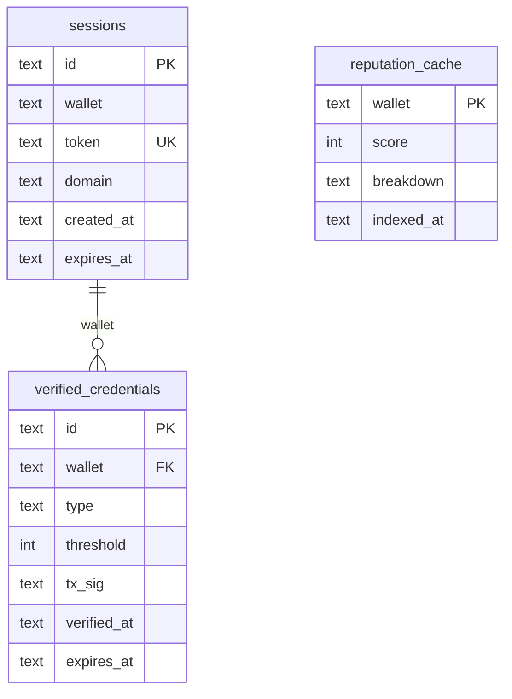

# .sol Login SDK

Sign in with your `.sol` name. Own your identity across every Solana app.

An open-source identity primitive that replaces raw wallet connection with a human-readable, reputation-carrying, ZK-verifiable identity layer. Users log in with their `.sol` domain. Developers get a drop-in SDK that resolves wallet, profile, reputation, and ZK credentials in one call.

**Track:** Social Identity -- SNS x Frontier Hackathon

---

## Table of Contents

- [Architecture](./docs/architecture.md)
- [Workflows](./docs/workflows.md)
- [Monorepo Structure](#monorepo-structure)
- [Quickstart](#quickstart)
- [SDK Packages](#sdk-packages)
- [Backend API](#backend-api)
- [ZK Circuits](#zk-circuits)
- [Configuration](#configuration)
- [Development](#development)
- [Deployment](#deployment)

---

## Architecture

See [Architecture Documentation](./docs/architecture.md) for detailed diagrams and component breakdowns.

---

## Authentication and Workflows

See [Workflows Documentation](./docs/workflows.md) for detailed sequence diagrams of the authentication flow and ZK proof pipeline.

---

## Monorepo Structure

```
sol-login/
  apps/
    demo/                   Vite + React demo app (real snarkjs proof generation)
    backend/                Express API — Postgres/Prisma, Helius, real Anchor submit
  packages/
    core/                   @sol-login/core (framework-agnostic)
    react/                  @sol-login/react (hooks + provider)
    express/                @sol-login/express (session middleware)
    circuits/               Circom ZK circuits + trusted-setup scripts
  programs/
    sol-login/              Anchor program (credential PDA store; off-chain verifier today)
  docs/
    architecture.md         Component diagram + responsibilities
    workflows.md            Auth + proof sequence diagrams
    deployment.md           End-to-end deploy (Postgres, Vercel, Railway, Helius)
    anchor-deploy.md        Program keypair, build, deploy, issuer wallet
```

---

## Quickstart

### Prerequisites

- Node.js 20+
- pnpm 9+
- Docker (for local Postgres) or a hosted Postgres URL
- `circom` 2.x on `PATH` (only required when (re)generating ZK circuit artifacts)
- A [Helius API key](https://www.helius.dev/) — required for reputation scoring
- A deployed Anchor program on devnet/mainnet — see [docs/anchor-deploy.md](./docs/anchor-deploy.md)

### Install and Run

```bash
git clone https://github.com/Dijo-404/.sol_login_sdk.git
cd .sol_login_sdk
pnpm install

# Configure environments — fill out every variable
cp apps/backend/.env.example apps/backend/.env
cp apps/demo/.env.example apps/demo/.env

# Provision Postgres + run migrations
docker run -d --name sol-login-pg -p 5432:5432 -e POSTGRES_PASSWORD=postgres -e POSTGRES_DB=sol_login postgres:16
pnpm --filter backend exec prisma migrate deploy

# Compile circuits + trusted setup (one-time)
pnpm --filter @sol-login/circuits run compile
pnpm --filter @sol-login/circuits run setup

pnpm dev:all
```

This starts:

- Frontend at `http://localhost:5173`
- Backend API at `http://localhost:4000`

### Integrate into Your dApp

```bash
yarn add @sol-login/react @sol-login/core
```

```jsx
import { SolLoginProvider, useSolLogin } from "@sol-login/react";

function App() {
  return (
    <SolLoginProvider apiUrl="https://api.sollogin.id">
      <Page />
    </SolLoginProvider>
  );
}

function Page() {
  const { identity } = useSolLogin();
  if (!identity) return <SolLoginButton />;
  return <h1>gm, {identity.domain}</h1>;
}
```

---

## SDK Packages

### @sol-login/core

Framework-agnostic client and type definitions.

```
packages/core/src/
  client.js          SolLoginClient (API client)
  types.js           SolIdentity, ReputationScore, ZkCredential types
  auth/
    challenge.js     Challenge message builder
    session.js       Client-side JWT storage
  identity/
    resolver.js      SNS domain resolution via Bonfida
```

Key exports:

- `SolLoginClient` -- API client with auth, identity, reputation, and proof methods
- `buildChallengeMessage` -- Generates the sign-in challenge string
- `resolveDomain` / `reverseResolveDomain` -- SNS resolution helpers
- `REPUTATION_WEIGHTS` -- Scoring weight constants

### @sol-login/react

React bindings built on top of core.

```
packages/react/src/
  context/
    SolLoginProvider.jsx   Context provider + state management
  index.js                 Re-exports
```

Key exports:

- `SolLoginProvider` -- Wraps the app with identity state
- `useSolLogin` -- Hook returning identity, login, logout, requestProof

### @sol-login/express

Server-side session verification middleware.

```
packages/express/src/
  index.js    verifySolSession middleware
```

Usage:

```js
import { verifySolSession } from "@sol-login/express";

app.get("/protected", verifySolSession(JWT_SECRET), (req, res) => {
  res.json({ wallet: req.solIdentity.wallet });
});
```

---

## Backend API

### Endpoints

| Method | Path                            | Auth | Description                                   |
| ------ | ------------------------------- | ---- | --------------------------------------------- |
| `POST` | `/auth/challenge`               | No   | Issue nonce + message for wallet to sign      |
| `POST` | `/auth/verify`                  | No   | Verify signature, resolve identity, issue JWT |
| `GET`  | `/auth/me`                      | Yes  | Return current session identity               |
| `POST` | `/auth/logout`                  | Yes  | Invalidate session                            |
| `GET`  | `/identity/:name`               | No   | Resolve .sol name to SolIdentity              |
| `GET`  | `/identity/reverse/:wallet`     | No   | Reverse resolve wallet to .sol                |
| `GET`  | `/identity/explore/leaderboard` | No   | List all known identities                     |
| `GET`  | `/reputation/:wallet`           | No   | Get reputation score breakdown                |
| `POST` | `/reputation/:wallet/refresh`   | Yes  | Force re-index reputation                     |
| `POST` | `/proof/verify`                 | Yes  | Submit ZK proof for verification              |
| `GET`  | `/proof/:wallet/credentials`    | No   | Get verified credentials                      |

### Data Model



---

## ZK Circuits

Located in `packages/circuits/`. Each circuit is written in Circom 2.0 and compiled to Groth16.

| File                          | Description                               |
| ----------------------------- | ----------------------------------------- |
| `reputation_threshold.circom` | Prove reputation score >= threshold       |
| `wallet_age.circom`           | Prove wallet age >= N months              |
| `sybil_nullifier.circom`      | Per-app uniqueness via Poseidon nullifier |
| `social_ownership.circom`     | Prove social account ownership blind      |

### Compile

```bash
cd packages/circuits
./scripts/compile.sh
./scripts/setup.sh
```

Outputs: `.wasm`, `.zkey`, `.vkey` files in `build/`.

---

## Configuration

Both apps fail fast if any required variable is missing — there are no insecure dev fallbacks. Copy the templates and fill them in:

```bash
cp apps/backend/.env.example apps/backend/.env
cp apps/demo/.env.example apps/demo/.env
```

The full list of required variables and how to generate each (JWT secret, Helius API key, Anchor program ID, issuer keypair, Postgres URL) lives in [apps/backend/.env.example](./apps/backend/.env.example) and [apps/demo/.env.example](./apps/demo/.env.example).

---

## Development

```bash
# Start Postgres locally (required — there is no SQLite fallback)
docker run -d --name sol-login-pg -p 5432:5432 -e POSTGRES_PASSWORD=postgres -e POSTGRES_DB=sol_login postgres:16

# Apply database schema
pnpm --filter backend exec prisma migrate deploy

# Compile circuits + run trusted setup (one-time; requires `circom` on PATH)
pnpm --filter @sol-login/circuits run compile
pnpm --filter @sol-login/circuits run setup

# Run the stack
pnpm dev:all          # Frontend + backend in parallel
pnpm dev              # Frontend only
pnpm dev:backend      # Backend only
pnpm build            # Production build all packages
pnpm lint             # Lint all packages
```

### Wallet Support

The demo app supports all Wallet Standard-compliant wallets:

- Phantom
- Solflare
- Backpack
- MetaMask (via Solflare Snap)

Wallets are auto-detected at runtime. No legacy adapters are required.

---

## Deployment

See [docs/deployment.md](./docs/deployment.md) for the full step-by-step (Postgres provisioning, Anchor program deploy, ZK trusted setup, Vercel + Railway). The short version:

- **Frontend** — Vercel, configured by [apps/demo/vercel.json](./apps/demo/vercel.json). Set `VITE_API_URL`, `VITE_SOLANA_NETWORK`, `VITE_SOLANA_RPC` in the project env.
- **Backend** — Containerized via [apps/backend/Dockerfile](./apps/backend/Dockerfile); deploy to Railway, Render, Fly, or any Docker host. Requires a managed Postgres (`DATABASE_URL`) and all variables from `.env.example`.
- **Anchor program** — Deploy once before the backend can issue real credentials. See [docs/anchor-deploy.md](./docs/anchor-deploy.md).
- **CI/CD** — [.github/workflows/ci.yml](./.github/workflows/ci.yml) lints, builds, and runs a Postgres-backed health check. [.github/workflows/deploy.yml](./.github/workflows/deploy.yml) is a manual-dispatch deploy for Vercel + Railway.

---

## Reputation Scoring

Scores range from 0 to 1000 and are computed from real protocol interactions via the [Helius enhanced transactions API](https://www.helius.dev/), with the wallet's first-tx timestamp used for domain age. No on-chain interaction with a program counts toward a factor unless that protocol's program ID is matched in the transaction.

| Factor              | Weight | Source                                                                  |
| ------------------- | ------ | ----------------------------------------------------------------------- |
| DeFi activity       | 30%    | Program-ID matches against Jupiter v6, Marinade, Drift v2 (log-scaled)  |
| Governance          | 25%    | Program-ID matches against Realms (`GovER5...`), log-scaled             |
| NFT activity        | 15%    | Program-ID matches against Tensor and Magic Eden v2 (log-scaled)        |
| Domain age          | 20%    | Time since first signature (Helius, with `getSignaturesForAddress` fallback) |
| Social verification | 10%    | Presence of an SNS social token account for the wallet                  |

Scores are cached for 6 hours in `reputation_cache` (Postgres) with an authenticated refresh endpoint to force re-index.

---

## License

MIT
