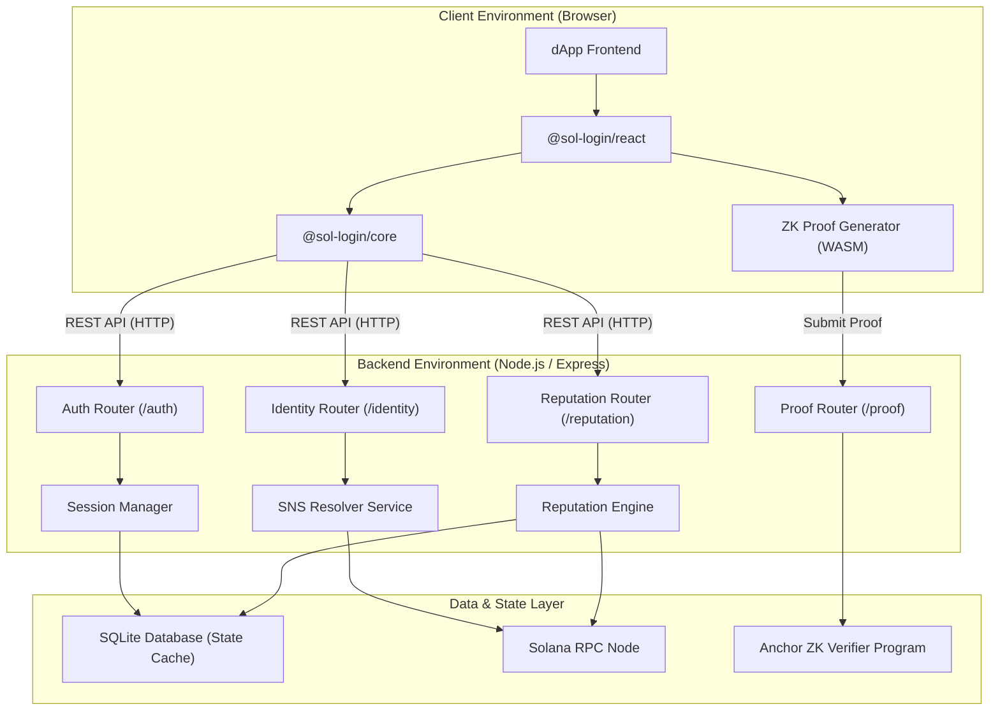

# Architecture

The .sol Login SDK is built on a modern, decoupled architecture designed to provide a secure and verifiable identity layer on top of Solana. It consists of the following primary components:

## High-Level Component Diagram

## Component Breakdown

### 1. Client Environment
- **@sol-login/react**: Provides React context and UI components (like the Login Button) to easily integrate the SDK into React applications.
- **@sol-login/core**: Contains the core logic for API communication, message signing challenges, and token management. It is framework-agnostic.
- **ZK Proof Generator**: Uses compiled WASM circuits to generate Zero-Knowledge proofs directly in the user's browser, ensuring private data never leaves the client.

### 2. Backend Environment
- **Auth Service**: Manages the Ed25519 challenge-response cycle and issues JWTs for authenticated sessions.
- **SNS Resolver Service**: Interfaces with the Solana Name Service (Bonfida) to resolve `.sol` domains to wallet addresses and vice-versa, fetching associated records (avatars, social links).
- **Reputation Engine**: Analyzes on-chain activity (DeFi usage, governance participation, NFT trades, wallet age) to compute a normalized reputation score.
- **Proof Service**: Receives client-generated ZK proofs and validates them either locally or via the Anchor smart contract.

### 3. Data & State Layer
- **SQLite Database**: Used for caching reputation scores, managing active sessions, and storing verified credential records.
- **Solana RPC**: Provides the on-chain data necessary for SNS resolution and reputation computation.
- **Anchor Program**: A Solana smart contract designed to natively verify Groth16 zk-SNARK proofs on-chain.
