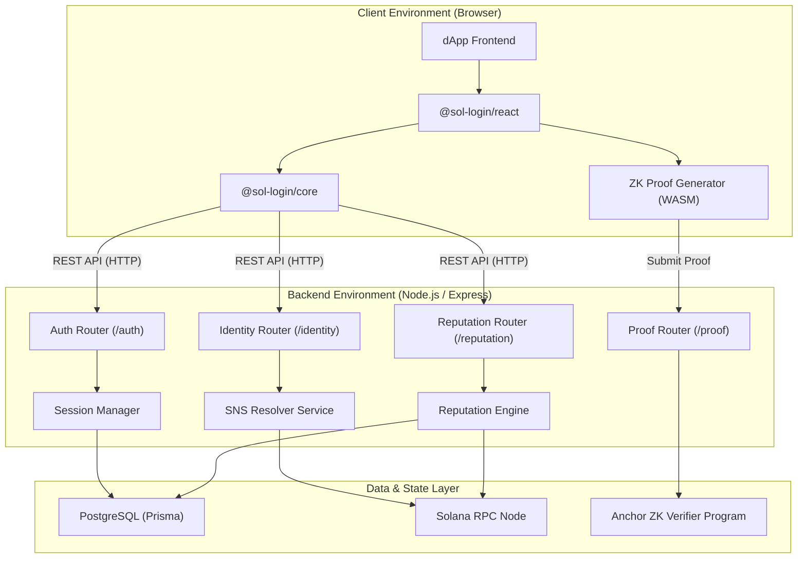

# Architecture

The .sol Login SDK is built on a modern, decoupled architecture designed to provide a secure and verifiable identity layer on top of Solana. It consists of the following primary components:

## High-Level Component Diagram

## Component Breakdown

### 1. Client Environment
- **@sol-login/react**: Provides React context and UI components (like the Login Button) to easily integrate the SDK into React applications.
- **@sol-login/core**: Contains the core logic for API communication, message signing challenges, and token management. It is framework-agnostic.
- **ZK Proof Generator**: Uses compiled WASM circuits to generate Zero-Knowledge proofs directly in the user's browser, ensuring private data never leaves the client.

### 2. Backend Environment
- **Auth Service**: Manages the Ed25519 challenge-response cycle and issues JWTs for authenticated sessions. Sessions are persisted in Postgres via Prisma.
- **SNS Resolver Service**: Interfaces with the Solana Name Service (Bonfida) to resolve `.sol` domains to wallet addresses and vice-versa, fetching associated records (avatars, social links).
- **Reputation Engine**: Calls the Helius enhanced transactions API and matches transactions against known program IDs (Jupiter, Marinade, Drift, Tensor, Magic Eden, Realms, SNS) to compute a per-protocol reputation score. Falls back to `getSignaturesForAddress` for wallet-age data.
- **Proof Service**: Receives client-generated ZK proofs, verifies them with `snarkjs.groth16.verify` against the matching `.vkey.json`, then submits an Anchor transaction that records a `Credential` PDA seeded by the user's wallet. The backend signer pays rent; the user wallet owns the PDA.

### 3. Data & State Layer
- **PostgreSQL (Prisma)**: Stores `sessions`, `reputation_cache` (6h TTL), and `verified_credentials`. Schema lives in [apps/backend/prisma/schema.prisma](../apps/backend/prisma/schema.prisma).
- **Helius**: Enhanced transactions API used to parse program-level activity for reputation scoring.
- **Solana RPC**: Direct RPC connection for SNS resolution, signature history, and submitting credential transactions via Anchor.
- **Anchor Program**: A deployed Solana program (`sol-login`) that records `Credential` PDAs as the on-chain anchor of trust. Proof bytes are stored in the instruction payload and emitted via the `ProofVerified` event for future on-chain alt_bn128 verifier upgrades.
