# Workflows

This document outlines the primary workflows of the `.sol` Login SDK.

## Authentication Workflow

The authentication process relies on cryptographic signatures to verify wallet ownership, followed by identity resolution using the Solana Name Service (SNS).

```mermaid
sequenceDiagram
    autonumber
    actor User
    participant App as dApp Frontend
    participant Core as @sol-login/core
    participant API as Backend API
    participant RPC as Solana RPC

    User->>App: Clicks "Sign in with .sol"
    App->>Core: Request authentication
    Core->>API: POST /auth/challenge (walletAddress)
    API-->>Core: Return nonce & challenge message
    Core->>User: Request wallet signature (Ed25519)
    User-->>Core: Approves & signs message
    Core->>API: POST /auth/verify (signature, walletAddress)
    
    rect rgb(20, 24, 30)
        Note over API,RPC: Identity Resolution Phase
        API->>API: Verify Ed25519 signature
        API->>RPC: Fetch SNS records for wallet
        RPC-->>API: Domain name, Avatar, Socials
        API->>RPC: Fetch on-chain history for Reputation
        RPC-->>API: Tx count, balance, tokens
    end

    API->>API: Compute Reputation Score
    API->>API: Issue JWT Session
    API-->>Core: Session Token & Identity Object
    Core-->>App: Update state & render profile
    App-->>User: Display authenticated state
```

## Zero-Knowledge Credential Workflow

Users can prove specific attributes (like reputation threshold or wallet age) without exposing the underlying data.

```mermaid
sequenceDiagram
    autonumber
    actor User
    participant App as dApp Frontend
    participant WASM as ZK Prover (Local)
    participant API as Backend API
    participant Anchor as Solana Program (Verifier)

    User->>App: Request Credential (e.g., Reputation > 500)
    App->>WASM: Initialize Groth16 circuit
    
    rect rgb(20, 24, 30)
        Note over App,WASM: Private Execution
        App->>WASM: Supply private inputs (exact score, salt)
        WASM->>WASM: Compute witness
        WASM->>WASM: Generate zk-SNARK proof
    end
    
    WASM-->>App: Proof Bytes & Public Signals
    App->>API: POST /proof/verify (proof, signals)
    API->>Anchor: Submit proof for on-chain verification
    Anchor-->>API: Verification Result
    
    alt is valid
        API->>API: Store verified credential
        API-->>App: Success & txSignature
        App-->>User: Display new credential badge
    else is invalid
        API-->>App: Rejection error
        App-->>User: Display verification failure
    end
```

